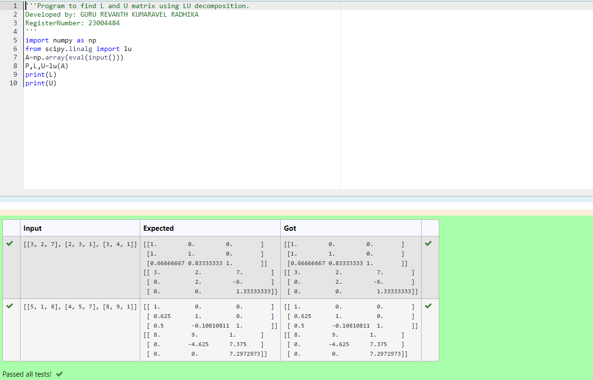
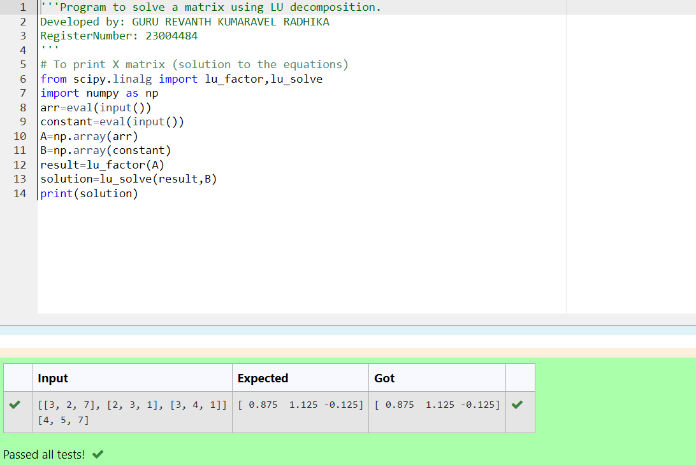

# LU Decomposition 

## AIM:
To write a program to find the LU Decomposition of a matrix.

## Equipments Required:
1. Hardware – PCs
2. Anaconda – Python 3.7 Installation / Moodle-Code Runner

## Algorithm
1. Import numpy as np.

2. Import library called 'scipy' to solve the lu decomposition.

3. Import lu_factor and lu_solve libraries.

4. Get the input to solve the lu decomposition.


## Program:
(i) To find the L and U matrix
```
/*
Program to find the L and U matrix.
Developed by: GURU REVANTH KUMARAVEL RADHIKA
RegisterNumber: 23004484
*/
import numpy as np
from scipy.linalg import lu
A=np.array(eval(input()))
P,L,U=lu(A)
print(L)
print(U)
```
(ii) To find the LU Decomposition of a matrix
```
/*
Program to find the LU Decomposition of a matrix.
Developed by: GURU REVANTH KUMARAVEL RADHIKA
RegisterNumber: 23004484
*/
# To print X matrix (solution to the equations)
from scipy.linalg import lu_factor,lu_solve
import numpy as np
arr=eval(input())
constant=eval(input())
A=np.array(arr)
B=np.array(constant)
result=lu_factor(A)
solution=lu_solve(result,B)
print(solution)
```


## Output:

(i) To find the L and U matrix

(ii) To find the LU Decomposition of a matrix



## Result:
Thus the program to find the LU Decomposition of a matrix is written and verified using python programming.